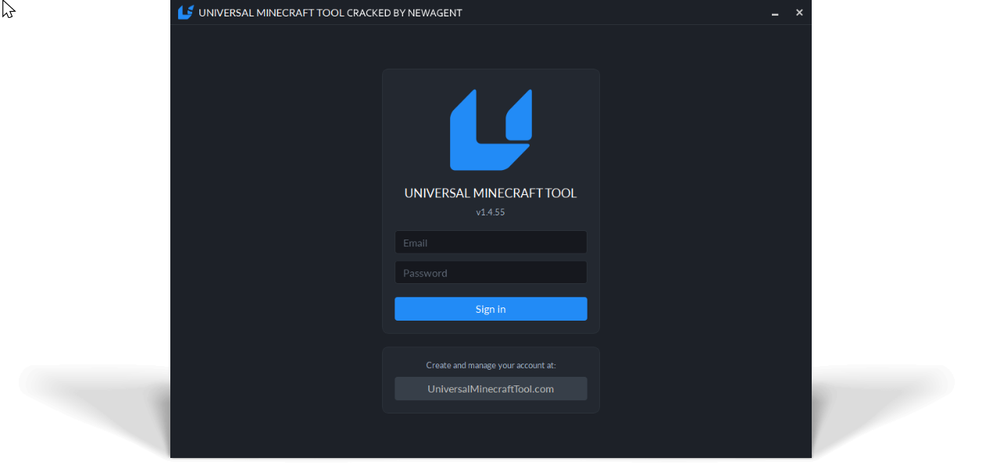

# UMT_Cracked (Universal Minecraft Tool)
## ⚠️DISCLAIMER ANYONE⚠️
WHO HAS SAID TO HAVE MADE A CRACK OF THE PROGRAM IS LYING THIS IS THE ONLY OFFICAL AND WORKING VERSION THAT IS NOT FAKE AND OPEN SOURCE
SnooPeanuts4040 Or IcyModz420 Aka XeIcyScopez HAS NOT HAD ANY WORK IN THIS PROJECT IN ANYWAY SHAPE OR FORM
## I AM THE OFFICIAL DEVELOPER OF THIS PROJECT NO ONE ELSE HAS HELPED IN ANYWAY

## Overview

**UMT_Cracked** is a modified version of the Universal Minecraft Tool designed to allow access to the software without requiring a paid license.
The original application is not free to use, and this project was created to provide an alternative method for people who cannot afford the software or who simply want to test its functionality before purchasing.

This repository contains the required files and supporting components that allow the program to run without triggering license or account validation errors.

---
<h3>Live Discord And GitHub Status</h3>

  

# Preview Of (UMT_Cracked)
  

## How It Works

### 1. Authentication Bypass

* The `sign-in.php` file simulates a **successful login request** to the software.
* It returns a response that makes the application believe:

  * The account exists
  * The login credentials are valid
  * The software license is active
* This prevents login errors even when using **non-existent email/username and password combinations**.

### 2. Session Validation

* The `timeCheck.php` script loads data from the `timeCheckRes` file.
* This ensures:

  * No session expiration warnings
  * No invalid session popups
  * When attempting to convert, edit, or use the program’s features, it would not load correctly and would crash.

Without this component, the application would display **errors during authentication**.

### 3. Extension & Server Data

* The `extensionDoc` file is a **ZIP archive** containing a GitHub link used for:

  * Data verification
  * Server-side reference checks
  * This also contains the files, including images and other data for worlds players and tag editing images.
  * This file is **not strictly required** for functionality, but is included for completeness.

### 4. Logout Handling

* The `sign-out.php` file enables:

  * Proper logout behavior
  * No crashes or stuck sessions when exiting the account

---

## Chunk Loading & Conversion Fix

If the software is launched without modification USING the custom ui/overlay then the:

* **Chunks will not load**
* **World conversion will fail**
* **Editor and pruning tools will not function**

This happens because the original program depends on:

`
Data from the official server or domain name is handled by updateActivityLog.php and timeCheck.php
`

which checks for the presence and validity of:

`
UMT_STREAM_ENDED and its AES encryption/decryption mechanisms, along with block processing and several additional components that were added to the system.
`

### So It Was Decided

To restore full functionality, so an additional program e.g software is required. When using the UI overlay in this custom program, the following factors are taken into account:

* A **compatibility layer** is added on top of the cracked software.
* This secondary layer:

  * Loads chunk data normally
  * Enables world conversion between platforms
  * Restores editor and pruning features
  * Mimics the behavior of the original licensed environment

From the application’s perspective, everything appears **fully legitimate and operational**.

---

## Version Handling

* The `version.php` file is **required for any future UMT_Cracked fixes**.
* It only exists so the software:

  * Reports the expected version number
  * Avoids update or mismatch warnings
---

## Working Types For UMT_Cracked

| World Conversion Type     | Version Requirement | Working        |
|--------------------------|--------------------|----------------|
| Xbox 360 → PS3           |  TU1 To TU68–TU73  | ✔️             |
| Xbox 360 → Wii U         |  TU1 To TU68–TU73  | ✔️             |
| PS3 → Xbox 360           |  TU1 To TU68–TU73  | ✔️             |
| Wii U → Xbox 360         |  TU1 To TU68–TU73  | ✔️             |
| (Encrypted) PS3 GAMEDATA |  ❌ Not Supported  | ❌ Not Supported |
| Wii U → PS3              |  TU1 To TU68–TU73  | ✔️             |
| PS3 → Wii U              |  TU1 To TU68–TU73  | ✔️             |
| Xbox 360 → JAVA          | TU1 To Any Version | ✔️             |
| PS3 → JAVA               | TU1 To Any Version | ✔️             |
| Wii U → JAVA             | TU1 To Any Version | ✔️             |
| JAVA → Xbox 360          | PC Java To TU1-TU73 | ✔️             |
| JAVA → PS3               | PC Java To TU1-TU73 | ✔️             |
| JAVA → Wii U             | PC Java To TU1-TU73 | ✔️             |
> ⚠️TAKE NOTE: Mob spawners are removed during conversion to prevent save failures and potential world crashes.

> Converting from Java to console may currently result in the loss of mobs, blocks, items, and other data. This is a known limitation and will be addressed in a future update.

>In comparison, the official UMT software removes mobs and some items during both console to console and Java to console conversions, while my version preserves this data for console to console worlds.

Click Here To See What Items UMT Changes

<strong>None For TU73</strong>

<strong>UMT Replaces TU68</strong>
  
- minecraft:dark_oak_stairs To minecraft:jungle_stairs Aka id:163

<strong>UMT Removes TU68</strong>
- minecraft:prismarine_slab 0
- minecraft:prismarine_slab 1
- minecraft:prismarine_slab 2
- minecraft:prismarine_bricks_stairs 2
- minecraft:dark_prismarine_stairs 2
- minecraft:prismarine_stairs 2
- minecraft:blue_ice 0
- minecraft:spruce_trapdoor 0
- minecraft:birch_trapdoor 0
- minecraft:jungle_trapdoor 0
- minecraft:acacia_trapdoor 0
- minecraft:dark_oak_trapdoor 0
- minecraft:sandstone 2
- minecraft:dried_kelp_block 0
- minecraft:leaves2 8
- minecraft:leaves2 9
- minecraft:tallgrass 0
- minecraft:stripped_log_oak 0
- minecraft:stripped_log_spruce 0
- minecraft:stripped_log_birch 0
- minecraft:stripped_log_jungle 0
- minecraft:stripped_log_acacia 0
- minecraft:stripped_log_dark_oak 0
- minecraft:turtle_egg 0
- minecraft:coral_block 0
- minecraft:coral_block 1
- minecraft:coral_block 2
- minecraft:coral_block 3
- minecraft:coral_block 4
- minecraft:coral_block 5
- minecraft:coral_block 6
- minecraft:coral_block 7
- minecraft:coral_block 8
- minecraft:coral_block 9
- minecraft:coral_block 10
- minecraft:coral_block 11
- minecraft:coral_block 12
- minecraft:coral_fan_dead 0
- minecraft:coral_fan_dead 1
- minecraft:coral_fan_dead 2
- minecraft:coral_fan_dead 3
- minecraft:coral_fan_dead 4
- minecraft:piston 5
- minecraft:sticky_piston 5
- minecraft:spruce_button 4
- minecraft:birch_button 4
- minecraft:jungle_button 4
- minecraft:acacia_button 4
- minecraft:dark_oak_button 4
- minecraft:spruce_pressure_plate 0
- minecraft:birch_pressure_plate 0
- minecraft:jungle_pressure_plate 0
- minecraft:acacia_pressure_plate 0
- minecraft:dark_oak_pressure_plate 0
- minecraft:coral_fan 0
- minecraft:coral_fan 1
- minecraft:coral_fan 2
- minecraft:coral_fan 3
- minecraft:coral_fan 4
- minecraft:coral 0
- minecraft:coral 1
- minecraft:coral 2
- minecraft:coral 3
- minecraft:coral 4
- minecraft:sea_grass 0
- minecraft:kelp 0
- minecraft:sea_pickle 0
- minecraft:silver_shulker_box 1
- minecraft:command_block 0
- minecraft:repeating_command_block 0
- minecraft:chain_command_block 0
- minecraft:command_block_minecart 0
- minecraft:water 0
- minecraft:lava 0

---

<h3>Creator Blocked Me</h3>

<h3>Click Here For: Possible Sources & Confirmed Components Used In Official UMT</h3>

**Chunker (Likely Used)**
Tool for upgrading/downgrading Minecraft worlds and converting between editions.  
- Java: 1.21.11 → 1.8.8  
- Bedrock: 1.21.130 → 1.12.1.1  
- Supports Java ↔ Bedrock + Bedrock downgrading and upgrading
- [Chunker Open Source](https://github.com/HiveGamesOSS/Chunker)

> There is no official proof Mat used Chunker, but it would make sense logically instead of rebuilding these systems repeatedly.

**leveldb-mcpe-latest-build (Confirmed)**  
- [Leveldb-MCPE-Latest-Build](https://github.com/Amulet-Team/leveldb-mcpe)
- Used for handling Bedrock world data (LevelDB format)  
- Confirmed via UMT source code

**XMemcompress (Confirmed)**
- [XMemcompress](https://github.com/gibbed/XCompression)
- Used For Compiling And Decompiling Xbox 360 Files

## Purpose of This Project

This project was created to:

* Help users who **cannot afford** the original software
* Allow people to **test features before buying**
* Provide an **educational example** of how request validation systems function

---

## Disclaimer

This repository is provided for **educational and research purposes only**.

* No ownership of the original software is claimed.
* Users are responsible for how they use the contents of this repository.
* Supporting the original developers by purchasing legitimate software is always recommended if you are able to do so.
